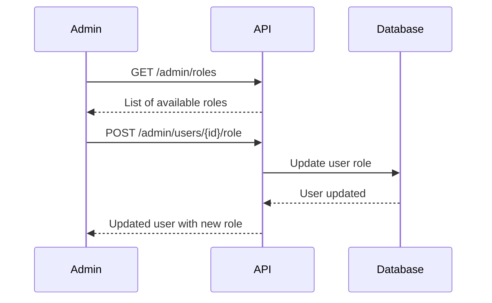

# Admin Management API Documentation

## Overview
Admin Management API cung cấp các endpoint để quản lý roles và thực hiện các tác vụ quản trị hệ thống. Tất cả endpoints đều yêu cầu xác thực JWT và quyền ADMIN.

**Base URL:** `http://localhost:3000/api/v1/admin`

## Authentication
Tất cả endpoints yêu cầu:
- **JWT Token** trong header `Authorization: Bearer <token>`
- **Role:** ADMIN (chỉ admin mới có thể truy cập)

## Endpoints

### 1. Get All Roles
Lấy danh sách tất cả roles trong hệ thống.

**Endpoint:** `GET /api/v1/admin/roles`

**Headers:**
```
Authorization: Bearer <access_token>
```

**Response:**
```json
[
  {
    "id": "123e4567-e89b-12d3-a456-426614174000",
    "name": "admin",
    "description": "Administrator with full access",
    "createdAt": "2024-01-01T00:00:00.000Z",
    "updatedAt": "2024-01-01T00:00:00.000Z"
  },
  {
    "id": "456e7890-e89b-12d3-a456-426614174001",
    "name": "user",
    "description": "Regular user with limited access",
    "createdAt": "2024-01-01T00:00:00.000Z",
    "updatedAt": "2024-01-01T00:00:00.000Z"
  }
]
```

**Status Codes:**
- `200`: Success
- `401`: Unauthorized - Invalid or missing token
- `403`: Forbidden - Admin role required

### 2. Assign Role to User
Gán role cho một người dùng cụ thể.

**Endpoint:** `POST /api/v1/admin/users/{id}/role`

**Path Parameters:**
- `id` (string, required): User UUID

**Headers:**
```
Authorization: Bearer <access_token>
Content-Type: application/json
```

**Request Body:**
```json
{
  "roleId": "123e4567-e89b-12d3-a456-426614174000"
}
```

**Validation Rules:**
- `roleId`: Required, valid UUID of existing role

**Response:**
```json
{
  "id": "user-uuid",
  "email": "user@example.com",
  "name": "John Doe",
  "phone": "0909090909",
  "address": "123 Main St",
  "roleId": "123e4567-e89b-12d3-a456-426614174000",
  "createdAt": "2024-01-01T00:00:00.000Z",
  "updatedAt": "2024-01-01T12:00:00.000Z",
  "role": {
    "id": "123e4567-e89b-12d3-a456-426614174000",
    "name": "admin",
    "description": "Administrator with full access"
  }
}
```

**Status Codes:**
- `200`: Role assigned successfully
- `400`: Bad request - validation failed
- `401`: Unauthorized
- `403`: Forbidden - Admin role required
- `404`: User not found

### 3. Seed Default Roles
Khởi tạo các roles mặc định trong hệ thống (admin, user).

**Endpoint:** `GET /api/v1/admin/seed-roles`

**Headers:**
```
Authorization: Bearer <access_token>
```

**Response:**
```json
{
  "message": "Roles seeded successfully"
}
```

**Status Codes:**
- `200`: Roles seeded successfully
- `401`: Unauthorized
- `403`: Forbidden - Admin role required

**Note:** Endpoint này chỉ tạo roles nếu chưa tồn tại. Nếu roles đã có, sẽ không tạo duplicate.

## Role Management

### Available Roles

#### 1. Admin Role
- **Name:** `admin`
- **Description:** Administrator with full access
- **Permissions:**
  - Access to all user management endpoints
  - Access to all admin management endpoints
  - Can assign/change roles
  - Can seed system data

#### 2. User Role
- **Name:** `user`
- **Description:** Regular user with limited access
- **Permissions:**
  - Can only access their own profile
  - Cannot manage other users
  - Cannot access admin endpoints

### Role Assignment Flow


## Data Models

### Role Entity
```typescript
{
  id: string;           // UUID, Primary Key
  name: string;         // Role name (admin, user)
  description?: string; // Role description
  createdAt: Date;      // Creation timestamp
  updatedAt: Date;      // Last update timestamp
}
```

### Role Assignment Request
```typescript
{
  roleId: string;       // UUID of the role to assign
}
```

## Error Handling

### Common Error Responses

**Unauthorized (401):**
```json
{
  "statusCode": 401,
  "message": "Unauthorized",
  "error": "Unauthorized"
}
```

**Forbidden (403):**
```json
{
  "statusCode": 403,
  "message": "Forbidden - Admin role required",
  "error": "Forbidden"
}
```

**Not Found (404):**
```json
{
  "statusCode": 404,
  "message": "User not found",
  "error": "Not Found"
}
```

**Validation Error (400):**
```json
{
  "statusCode": 400,
  "message": [
    "Role ID must be a valid UUID"
  ],
  "error": "Bad Request"
}
```

## Testing with cURL

### Get All Roles
```bash
curl -X GET http://localhost:3000/api/v1/admin/roles \
  -H "Authorization: Bearer YOUR_JWT_TOKEN"
```

### Assign Role to User
```bash
curl -X POST http://localhost:3000/api/v1/admin/users/USER_UUID/role \
  -H "Authorization: Bearer YOUR_JWT_TOKEN" \
  -H "Content-Type: application/json" \
  -d '{
    "roleId": "ROLE_UUID"
  }'
```

### Seed Default Roles
```bash
curl -X GET http://localhost:3000/api/v1/admin/seed-roles \
  -H "Authorization: Bearer YOUR_JWT_TOKEN"
```

## Admin Workflow Examples

### 1. Promote User to Admin
```bash
# 1. Get all roles
curl -X GET http://localhost:3000/api/v1/admin/roles \
  -H "Authorization: Bearer ADMIN_TOKEN"

# 2. Find admin role ID from response
# 3. Assign admin role to user
curl -X POST http://localhost:3000/api/v1/admin/users/USER_UUID/role \
  -H "Authorization: Bearer ADMIN_TOKEN" \
  -H "Content-Type: application/json" \
  -d '{
    "roleId": "ADMIN_ROLE_UUID"
  }'
```

### 2. Demote Admin to User
```bash
# 1. Get all roles
curl -X GET http://localhost:3000/api/v1/admin/roles \
  -H "Authorization: Bearer ADMIN_TOKEN"

# 2. Find user role ID from response
# 3. Assign user role to admin
curl -X POST http://localhost:3000/api/v1/admin/users/ADMIN_UUID/role \
  -H "Authorization: Bearer ADMIN_TOKEN" \
  -H "Content-Type: application/json" \
  -d '{
    "roleId": "USER_ROLE_UUID"
  }'
```

### 3. Initialize System Roles
```bash
# Seed default roles if not exist
curl -X GET http://localhost:3000/api/v1/admin/seed-roles \
  -H "Authorization: Bearer ADMIN_TOKEN"
```

## Security Considerations

### Role-Based Access Control
- Tất cả endpoints yêu cầu role ADMIN
- JWT token phải hợp lệ và chứa admin role
- Role được kiểm tra qua RolesGuard

### Data Integrity
- Role assignment được validate trước khi thực hiện
- Không cho phép assign role không tồn tại
- User phải tồn tại trước khi assign role

### Audit Trail
- Tất cả role changes được log
- Timestamps cho tất cả operations
- Admin actions được track thông qua JWT token

## System Administration

### Initial Setup
1. **Start the application**
2. **Create first admin user** (via registration)
3. **Seed default roles** (via seed endpoint)
4. **Promote first user to admin** (via role assignment)

### Role Management Best Practices
- Luôn có ít nhất 1 admin user trong hệ thống
- Không xóa admin role nếu chỉ còn 1 admin
- Log tất cả role changes để audit
- Regular review của user roles

## Rate Limiting
Currently no rate limiting implemented. Consider implementing rate limiting for production use.

## Notes
- Tất cả role IDs sử dụng UUID format
- Role names phải unique trong hệ thống
- Không thể xóa roles đang được sử dụng
- System roles (admin, user) được tạo tự động khi seed
